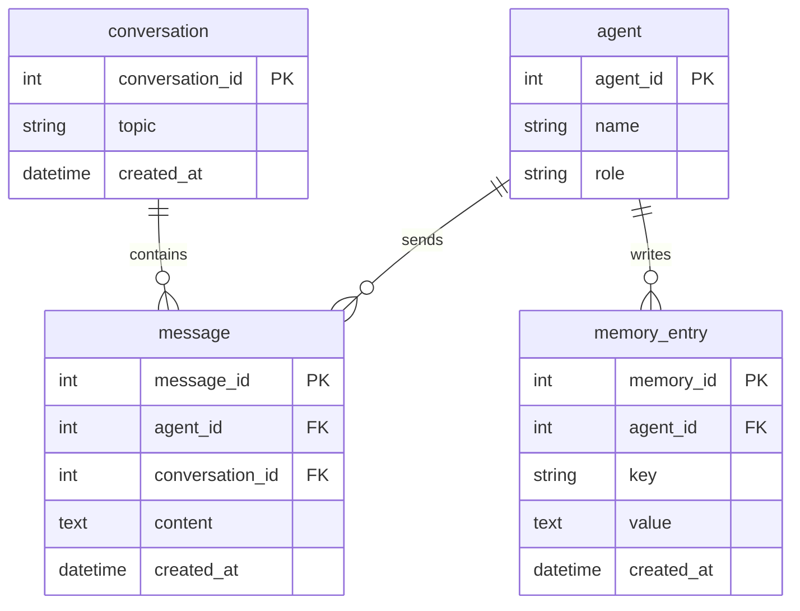

# Chatbot Memory Broker

This project models a shared memory and communication broker for multiple AI agents.  
Agents can write messages and structured memory entries to the same database, and users can ask natural-language questions that are translated to SQL and then translated back into friendly answers.

## Schema



## Query that worked well

**Question:** Which agent has sent the most messages?

**GPT SQL Response (zero-shot):**
```sql
SELECT agent.name, COUNT(message.message_id) AS message_count
FROM agent
JOIN message ON agent.agent_id = message.agent_id
GROUP BY agent.agent_id
ORDER BY message_count DESC
LIMIT 1;
```

**SQL Result:** `[('Assistant', 3)]`  
**Friendly Response:** The agent named "Assistant" has sent the most messages, with a total of 3 messages.

## Query that did not work well

**Question:** What did the Assistant say in the task_delegation conversation?

**Single-domain SQL Response (incorrect):**
```sql
SELECT m.content
FROM message m
JOIN conversation c ON m.conversation_id = c.conversation_id
WHERE c.topic = 'task_delegation';
```

**SQL Result:** Returned 4 rows, including messages from Router, MemoryKeeper, Assistant, and Summarizer.  
**Problem:** The query did not filter to only `Assistant`, so the answer mixed multiple agents.

**Better SQL (zero-shot):**
```sql
SELECT m.content
FROM message m
JOIN conversation c ON m.conversation_id = c.conversation_id
JOIN agent a ON m.agent_id = a.agent_id
WHERE c.topic = 'task_delegation' AND a.name = 'Assistant';
```

## Prompting strategies tried

- **Zero-shot**: schema + SQL-only instruction + question.
- **Single-domain double-shot**: schema + one in-domain example + SQL-only instruction + question.

## Strategy observations

- Zero-shot was better on questions that required precise filtering (for example, filtering by a specific agent).
- Single-domain sometimes produced cleaner human-language responses, but occasionally generalized the SQL pattern from the one example and missed important conditions.
